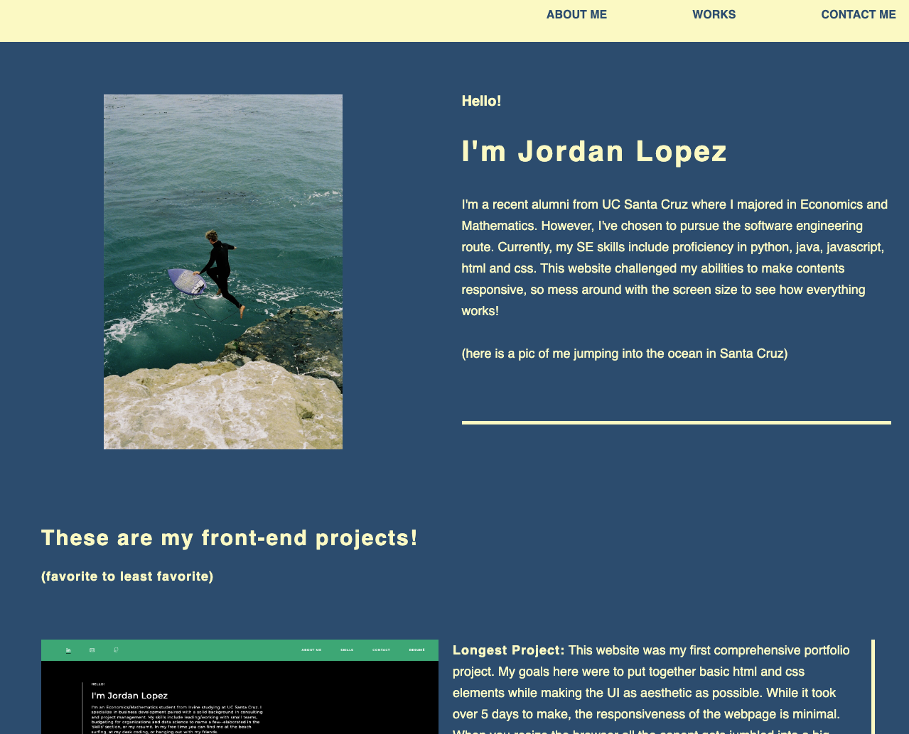

# second-portfolio-project

## Description 

For this project, I created a portfolio website that displayed my previous html and css projects. In this project, I focused on aesthetic via UI and creating the page responsively so it would work with all devices. This proved to be a large task because I wasn't super familiar with media queries or flexbox until now.
 

Here is the link to the deployed website: 
 
[Click Here for link](https://lopez-jordan.github.io/second-portfolio-project/)

## Credits

Credits to UC Berkeley Fullstack coding bootcamp repository:
 
[Click Here for link](https://github.com/coding-boot-camp/urban-octo-telegram)

© 2023 edX Boot Camps LLC. Confidential and Proprietary. All Rights Reserved.